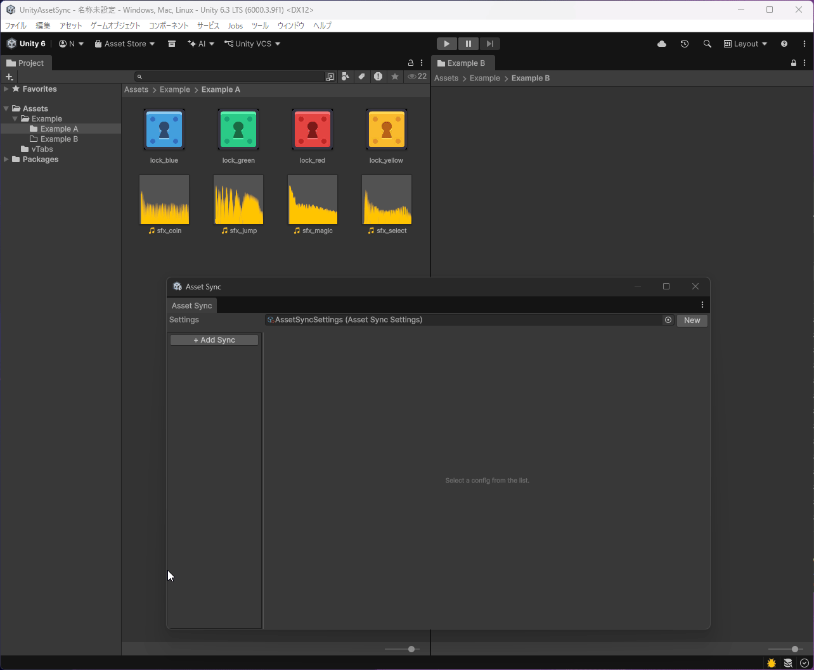

# Unity Asset Sync

[English](README.md) | [日本語](README.ja.md)

フォルダから別のフォルダへ、`.meta` ファイル以外のファイルを一方向で同期する Editor 専用 Unity パッケージです。

アセットを複製し、複製先ごとに異なるインポート設定を適用したい場合に便利です。その用途では [Presets by folder](https://docs.unity3d.com/Manual/DefaultPresetsByFolder.html) との併用をおすすめします。

## サンプル



## インストール

Package Manager の `Add package from git URL...` に、次の URL を入力してください。

```text
https://github.com/nyoro-wrl/UnityAssetSync.git?path=/Packages/com.nyoro_wrl.assetsync
```

## 使い方

1. `Window > Asset Sync` を開きます。
2. `New` で `AssetSyncSettings` アセットを作成します。
3. `Add Sync` で同期設定を追加し、`Source` と `Destination` フォルダを指定します。
4. `Sync` ボタンで同期を実行します。
5. 以降は `Enable` で有効/無効を切り替えます。

## 主な機能

- サブディレクトリを含めた同期
- プロジェクト内フォルダまたは外部ディレクトリを同期元に指定
- Unity の型による同期対象のフィルタリング
- 同期元の特定アセットまたはディレクトリの追加/除外
- 拡張子による追加/除外
- 正規表現による追加/除外
- 同期先の特定アセットの除外
