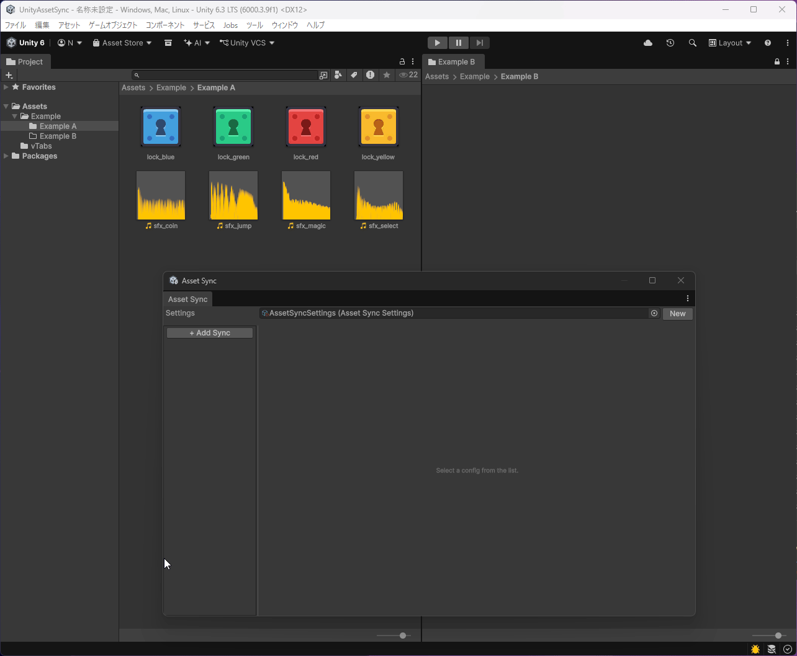

# Unity Asset Sync

[English](README.md) | [日本語](README.ja.md)

An editor-only Unity package for one-way synchronization of files (excluding `.meta` files) from one folder to another.

Useful when you want to duplicate assets and apply different import settings in each destination folder. For that workflow, using [EnforcePresetPostProcessor](https://docs.unity3d.com/Manual/DefaultPresetsByFolder.html) together is recommended.

## Sample



## Installation

In Unity Package Manager, use `Add package from git URL...` and paste:

```text
https://github.com/nyoro-wrl/UnityAssetSync.git?path=/Packages/com.nyoro_wrl.assetsync
```

## Usage

1. Open `Window > Asset Sync`.
2. Create an `AssetSyncSettings` asset with `New`.
3. Add a sync entry with `Add Sync`, then set `Source` and `Destination` folders.
4. Click `Sync` to run synchronization.
5. After that, use `Enable` to toggle active/inactive state.

## Main Features

- Synchronize with optional subdirectory support
- Filter synchronization targets by Unity type
- Include/exclude specific source assets (or directories)
- Exclude specific destination assets
